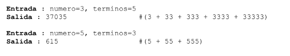

# Desafios de programación semanales 2024
### Proyecto de retos semanales para practicar lógica de programación utilizando cualquier lenguaje.

## ✨ Desafios

|  #   | Nombre del Desafio         | Descripción                                                              | Ejemplo 1  | Ejemplo 2
| --- | ---------------- | ------------------------------------------------------------------------ |  ------------------------------------------------------------------------ |------------------------------------------------------------------------ |
| 1   | **Número palíndromo** | Dado un número entero x, devuelve truesi xes un palíndromo, y falsede otra manera . | Entrada: x = 121   Salida: verdadero Explicación: 121 se lee como 121 de izquierda a derecha y de derecha a izquierda.| Entrada: arr = [1,2,3], fn = función plusI(n, i) { return n + i; }   Salida: [1,3,5]   Explicación: La función aumenta cada valor según el índice en el que reside.
| 2   | **convertir números decimales a romanos** | Se busca desarrollar un programa en cualquier lenguaje de programación que permita la conversión de números enteros a su equivalente en números romanos. Los números romanos son un sistema numeral antiguo utilizado en la Roma antigua y que hoy en día se emplea en diversas ocasiones simbólicas.| Ejemplo Entrada: num = 58  Salida: "LVIII" | Entrada: num = 1994  Salida: "MCMXCIV" |        
| 3   | **FIZZ BUZZ** | Escribe un programa que muestre por consola (con un print) los números de 1 a 100 (ambos incluidos y con un salto de línea entre cada impresión) sustituyendo los siguientes:  - Múltiplos de 3 por la palabra "fizz".  - Múltiplos de 5 por la palabra "buzz".  - Múltiplos de 3 y de 5 a la vez por la palabra "fizzbuzz".| Ejemplo Entrada: num = 6  Salida: "fizz" | Entrada: num = 5  Salida: "buzz" | 
| 4  | **GENERADOR DE CONTRASEÑAS** | Escribe un programa que sea capaz de generar contraseñas de forma aleatoria. Podrás configurar generar contraseñas con los siguientes parámetros: - Longitud: Entre 8 y 16.  - Con o sin letras mayúsculas.  - Con o sin números.  - Con o sin símbolos. (Pudiendo combinar todos estos parámetros entre ellos)| Salida: hN:_$tVN3< | Salida: 8yTN80zPmsiha5pz | 
| 5  | **SERIE DE NUMEROS** | Escriba una función que retorne la suma de una serie de X número repetido hasta el n-ésimo término. 
 | Ejemplo Entrada: num = 3  Salida: 37035 | Entrada: num = 5  Salida: 615  |

##  Instrucciones para Colaborar en el Repositorio:

1. Crea un Fork del repositorio.
2. Clona tu Fork localmente.
3. Sigue el video tutorial de Midulive: https://www.youtube.com/watch?v=BPns9r76vSI para orientación.
4. Encuentra desafíos en carpetas específicas; cada desafío tiene su carpeta.
5. En las carpetas de desafíos, hallarás subcarpetas para diferentes lenguajes; créalas si es necesario.
6. Asegúrate de respetar la estructura del repositorio.
7. Realiza tus contribuciones y envía pull requests desde tu Fork.
¡Gracias por tu colaboración!

## 👑 Contribuidores

